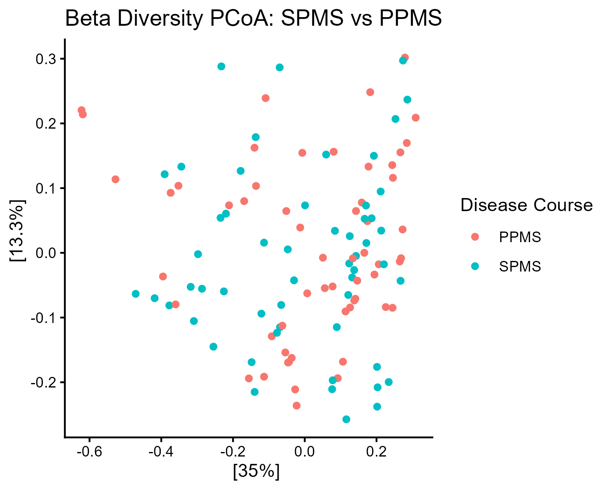
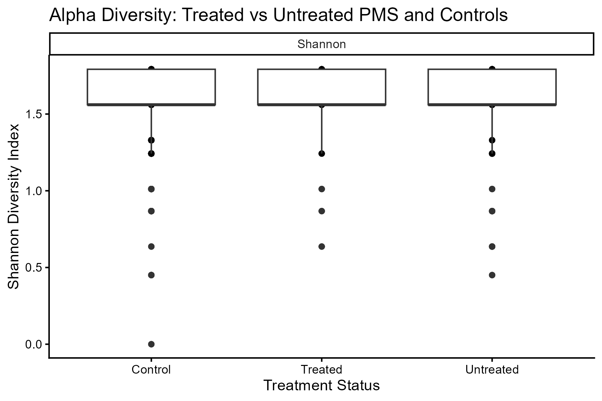
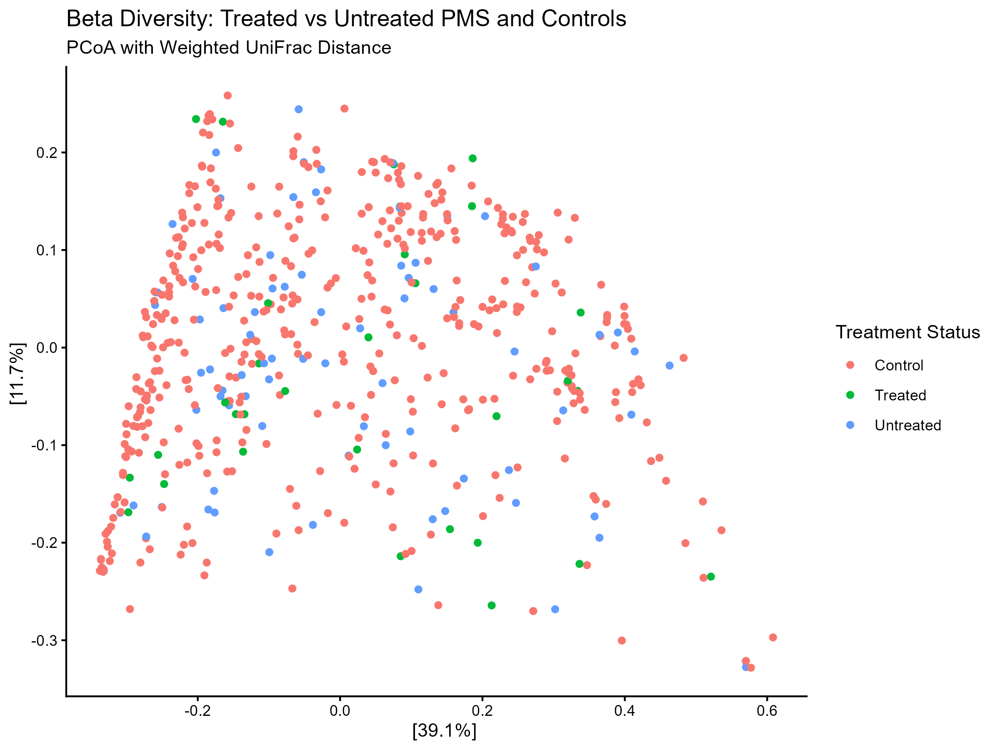

# Chapter 4 - Aim 1

## Purpose:
To compare the global diversity and compositional structure of the gut microbiome between treated and untreated PMS patients.

## Code:
[Aim 1 code](/Aim1_code.R)

## Visualizations:
### PRELIMINARY: Beta diversity SPMS vs PPMS (no controls)

No significant differences in gut microbiome composition were detected between SPMS and PPMS patients (PERMANOVA, R² = 0.006, F = 0.69, p = 0.714), indicating that these progressive MS subtypes can be combined into a single "PMS" category for subsequent analyses.

### Alpha diversity treated vs untreated PMS (with controls)

No significant differences in alpha diversity (Shannon Index) were detected across treatment status groups (Kruskal–Wallis, χ² = 2.75, df = 2, p = 0.253), indicating that treatment categories do not exhibit statistically distinguishable within-sample diversity.

### Beta diversity treated vs untreated PMS (with controls)

Treatment status significantly influenced gut microbiome composition (PERMANOVA, R² = 0.008, F = 2.32, p = 0.014), with significant differences detected among healthy controls, treated PMS, and untreated PMS groups.
Pairwise comparisons revealed that the overall treatment effect was primarily driven by differences between healthy controls and treated PMS patients (unadjusted p = 0.025), though this did not remain significant after Bonferroni correction for multiple testing (adjusted p = 0.075). No significant differences were detected between treated and untreated PMS patients (p = 0.337) or between healthy controls and untreated PMS patients (p = 0.058).

Pairwise PERMANOVA results: [treatment_pairwise_permanova](/treatment_pairwise_permanova.xlsx)