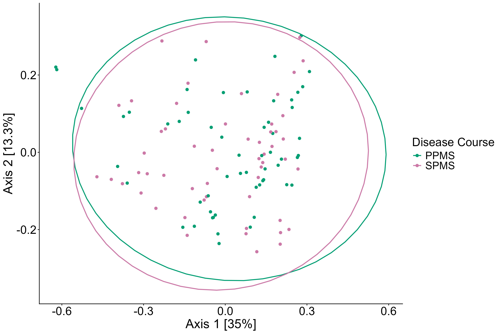
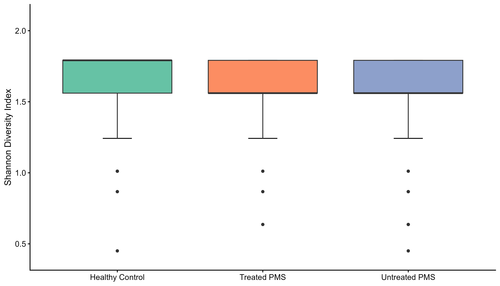
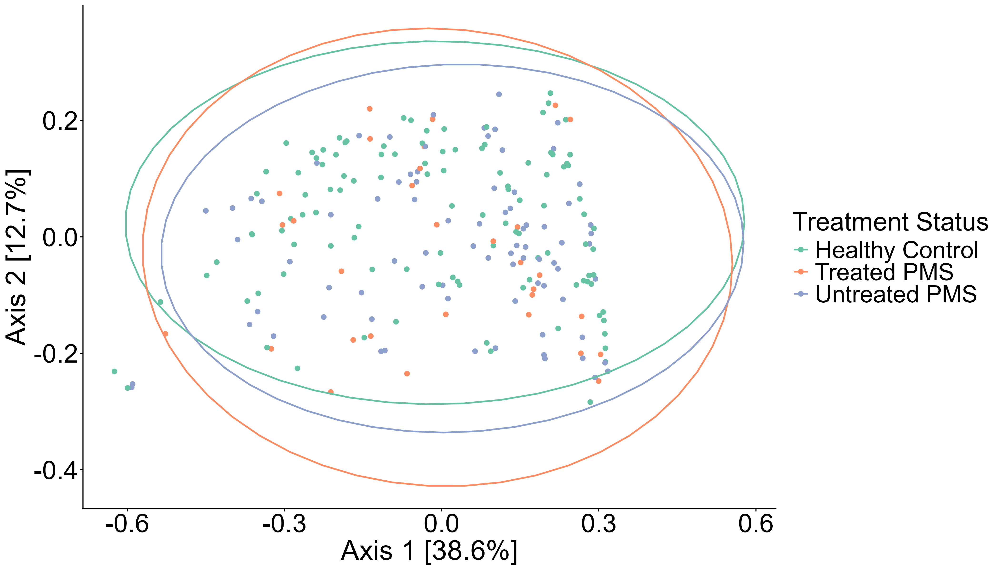

# Chapter 4 - Aim 1

## Purpose:
To compare the global diversity and compositional structure of the gut microbiome between treated and untreated PMS patients.

## Code:
* [Aim 1 code](/Aim1_code.R) - original code
* [Aim 1 code updated](/Aim1_code_updated.R) - updated code with RRMS_household_controls removed from RData

## Methods:
* Preliminary Analysis: SPMS vs PPMS Comparison
  * Beta diversity (weighted UniFrac distance and PCoA) was compared between SPMS and PPMS patients using PERMANOVA
  * if no significant difference was detected (p ≥ 0.05), these subtypes were combined into a single "PMS" category
* Alpha Diversity Analysis
  * Shannon diversity index was calculated for treated PMS, untreated PMS, and healthy control groups and visualized using boxplots
  * Kruskal-Wallis test was performed to assess differences across groups
* Beta Diversity Analysis
  * Weighted UniFrac distances were calculated and visualized using PCoA, with PERMANOVA testing for overall treatment effects across the three groups (treated PMS, untreated PMS, and healthy control)
  * If significant (p < 0.05), pairwise PERMANOVA comparisons were conducted between all group pairs, with p-values adjusted using FDR correction

## Visualizations:
### PRELIMINARY: Beta diversity SPMS vs PPMS (no controls)

No significant differences in gut microbiome composition were detected between SPMS and PPMS patients (PERMANOVA, R² = 0.006, F = 0.69, p = 0.700), indicating that these progressive MS subtypes can be combined into a single "PMS" category for subsequent analyses.

### Alpha diversity treated vs untreated PMS (with controls)

No significant differences in alpha diversity (Shannon Index) were detected across treatment status groups (Kruskal-Wallis, χ² = 5.51, df = 2, p = 0.064), indicating that treatment categories do not exhibit statistically distinguishable within-sample diversity.

### Beta diversity treated vs untreated PMS (with controls)

Treatment status significantly influenced gut microbiome composition (PERMANOVA, R² = 0.008, F = 2.32, p = 0.014), with significant differences detected among healthy controls, treated PMS, and untreated PMS groups.
Pairwise PERMANOVA comparisons revealed significant unadjusted differences between healthy controls and both untreated PMS (R² = 0.004, F = 2.19, p = 0.041) and treated PMS patients (R² = 0.006, F = 2.77, p = 0.022).
However, after FDR correction for multiple comparisons, these differences did not reach statistical significance (both p_FDR = 0.062).
No significant differences were detected between treated and untreated PMS patients (R² = 0.010, F = 1.09, p = 0.329).

* Overall PERMANOVE results: [treatment_permanova_results](/treatment_permanova_results.csv) - original
* Pairwise PERMANOVA results: [treatment_pairwise_permanova](/treatment_pairwise_permanova.csv) - original

After removing RRMS household controls from the analysis, treatment status did not significantly affect gut microbiome composition (PERMANOVA, R² = 0.015, F = 1.63, p = 0.095), indicating no detectable beta diversity differences among healthy controls, treated PMS, and untreated PMS patients in this updated dataset, and therefore pairwise comparisons were not performed.

* Overall PERMANOVA results: [treatment_permanova_results](/updated_treatment_permanova_results.csv) - after RRMS_household_controls were removed

