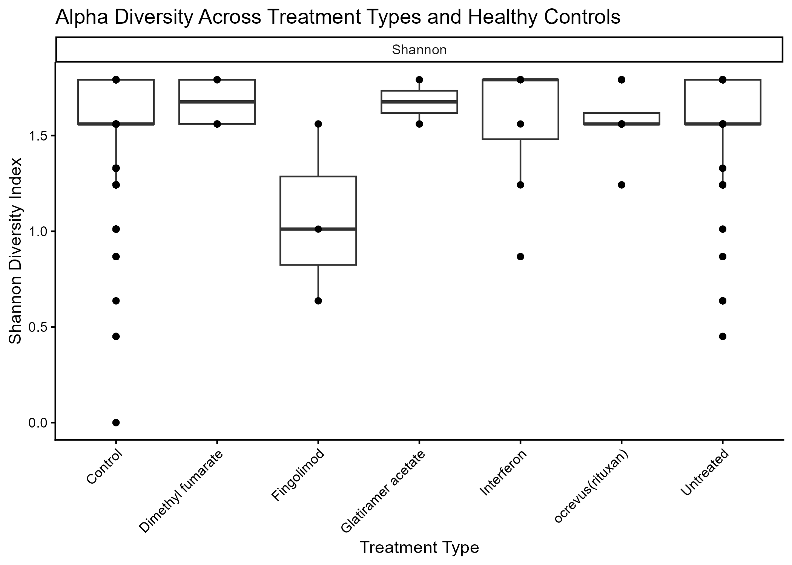
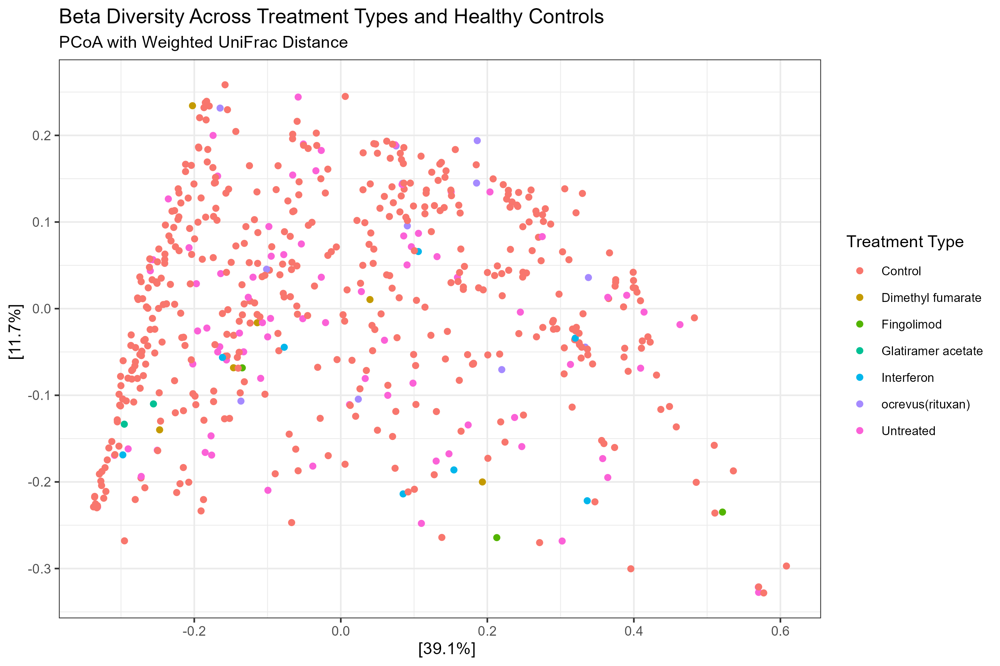
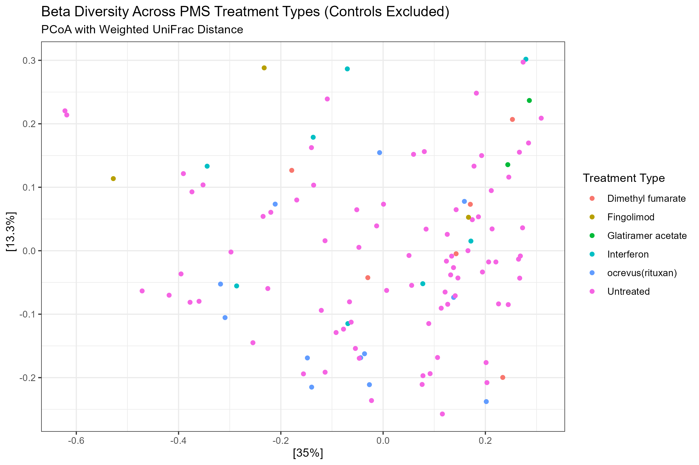

# Chapter 5 - Aim 2

## Purpose:
To evaluate whether distinct disease-modifying therapies are significantly associated with differences in gut microbiome profiles among PMS patients.

## Code:
[Aim 2 code](/Aim2_code.R)

## Visualizations:

### Alpha diversity untreated PMS vs. each treatment type (with controls)

No significant differences in alpha diversity (Shannon Index) were detected across individual treatment types, including untreated and healthy control participants (Kruskal–Wallis, χ² = 8.89, df = 6, p = 0.180), indicating that within-sample microbial diversity did not vary significantly by treatment type.

### Beta diversity untreated PMS vs. each treatment type (with controls)

### Beta diversity untreated PMS vs. each treatment type (no controls)

