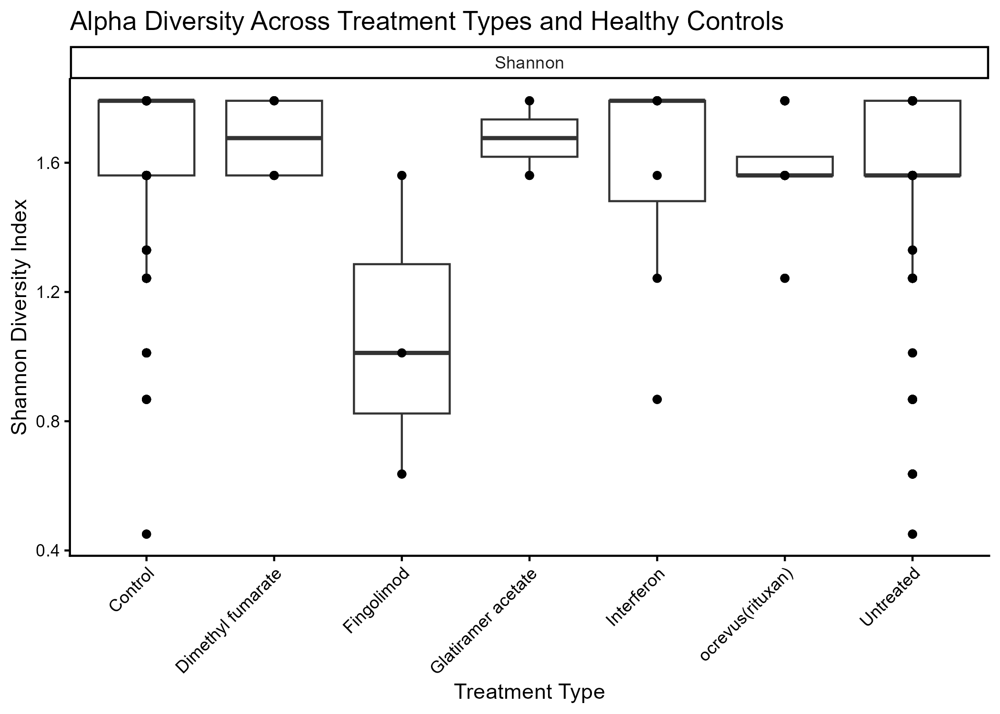
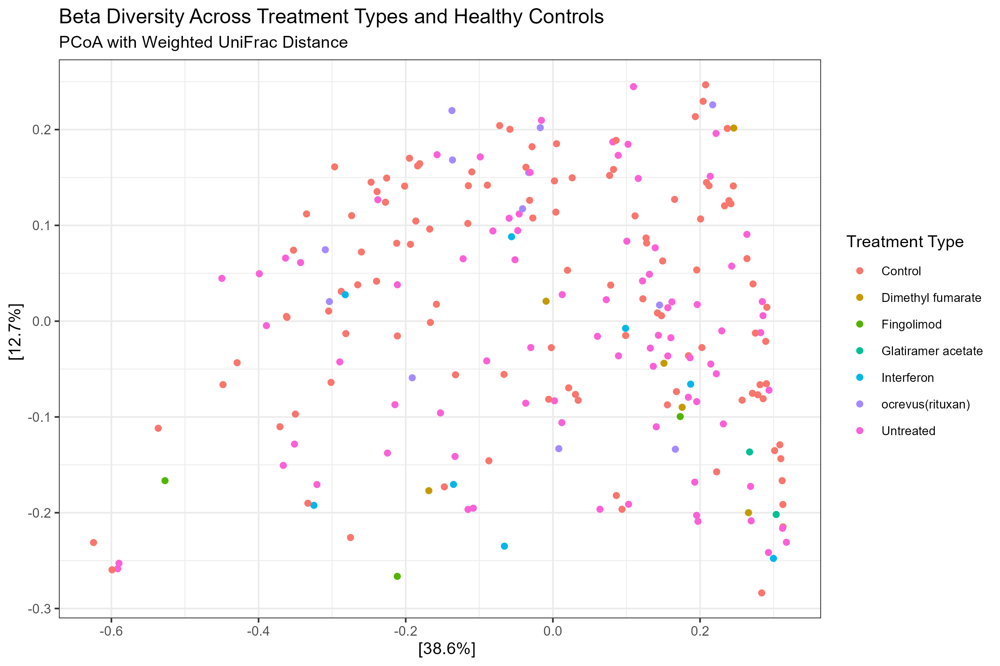
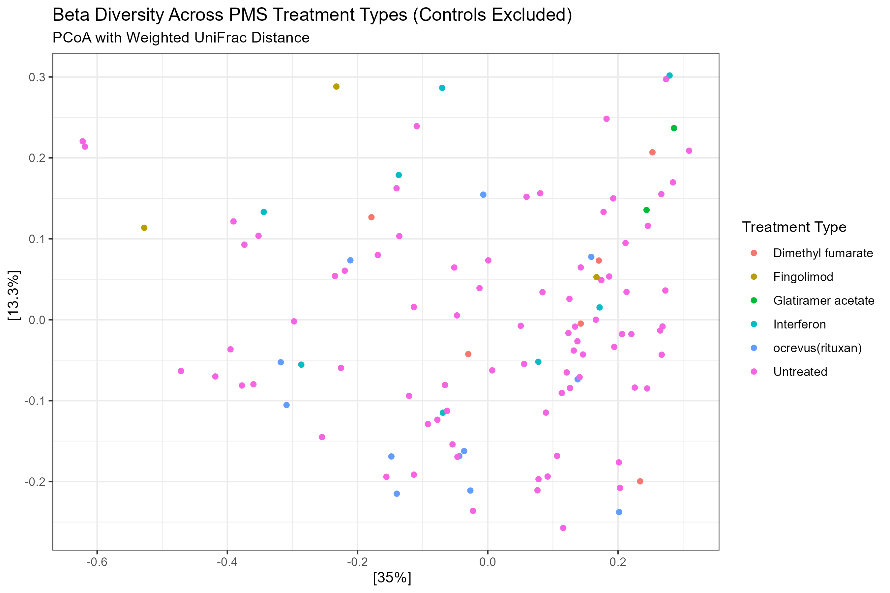

# Chapter 5 - Aim 2

## Purpose:
To evaluate whether distinct disease-modifying therapies are significantly associated with differences in gut microbiome profiles among PMS patients.

## Code:
[Aim 2 code](/Aim2_code.R) - original code
[Aim 2 code updated](/Aim2_code - Copy.R) - updated code with RRMS_household_controls removed from RData

## Methods:
* Alpha Diversity Analysis
  * Shannon diversity index was calculated across all treatment types (untreated PMS, dimethyl fumarate, fingolimod, glatiramer acetate, interferon, ocrevus/rituximab, and healthy controls) and visualized using boxplots
  * Kruskal-Wallis test was performed to assess differences across treatment groups
* Beta Diversity Analysis
  * Weighted UniFrac distances were calculated for all samples and visualized using PCoA, with PERMANOVA testing for overall treatment effects across all groups (untreated PMS, dimethyl fumarate, fingolimod, glatiramer acetate, interferon, ocrevus/rituximab, and healthy controls)
  * A second PCoA plot excluding healthy controls was generated to better visualize differences among PMS treatment types
  * If PERMANOVA was significant (p < 0.05), pairwise comparisons were conducted between each treatment type and untreated PMS, between untreated PMS and healthy controls, and between each treatment type and healthy controls
  * P-values were adjusted using FDR correction, with comparisons considered significant if p_FDR < 0.05

## Visualizations:

### Alpha diversity untreated PMS vs. each treatment type (with controls)

No significant differences in alpha diversity (Shannon Index) were detected across individual treatment types, including untreated and healthy control participants (Kruskal–Wallis, χ² = 11.36, df = 6, p = 0.0778), indicating that within-sample microbial diversity did not vary significantly by treatment type.

Kruskal-Wallis rank sum test results: [kruskal_treatments](/corrected_kruskal_treatments.csv)

### Beta diversity untreated PMS vs. each treatment type (with controls)

### Beta diversity untreated PMS vs. each treatment type (no controls)

Overall PERMANOVA results: [treatment_types_permanova_results](/updated_treatment_types_permanova_results.csv) - after RRMS_household_controls were removed

Pairwise PERMANOVA comparisons revealed that several treatment groups showed nominally significant microbiome differences before correction for multiple testing, including glatiramer acetate versus healthy controls (R² = 0.024, p = 0.025), glatiramer acetate versus untreated PMS patients (R² = 0.026, p = 0.047), and fingolimod versus healthy controls (R² = 0.019, p = 0.047). 
However, after FDR correction for 11 pairwise comparisons, none of these differences remained statistically significant (all p_FDR > 0.05).
Effect sizes remained small across all comparisons (R² < 0.03).

Pairwise PERMANOVA results: [treatment_types_pairwise_permanova](/treatment_types_pairwise_permanova.csv) - original
Pairwise PERMANOVA results: [treatment_types_pairwise_permanova](/updated_treatment_types_pairwise_permanova.csv) - after RRMS_household_controls were removed
