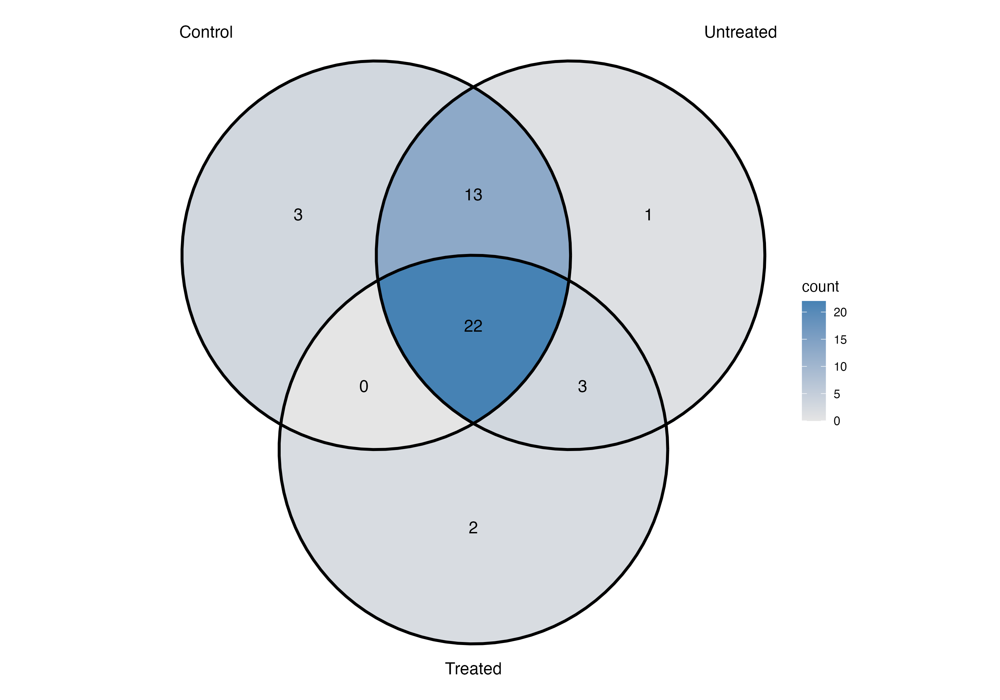
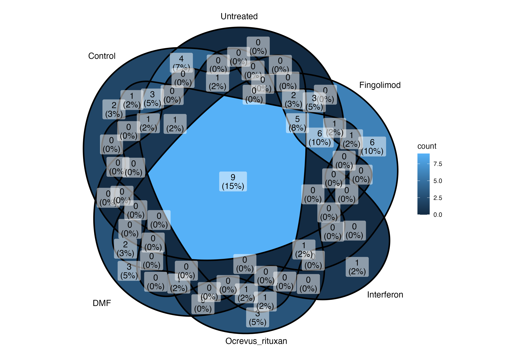
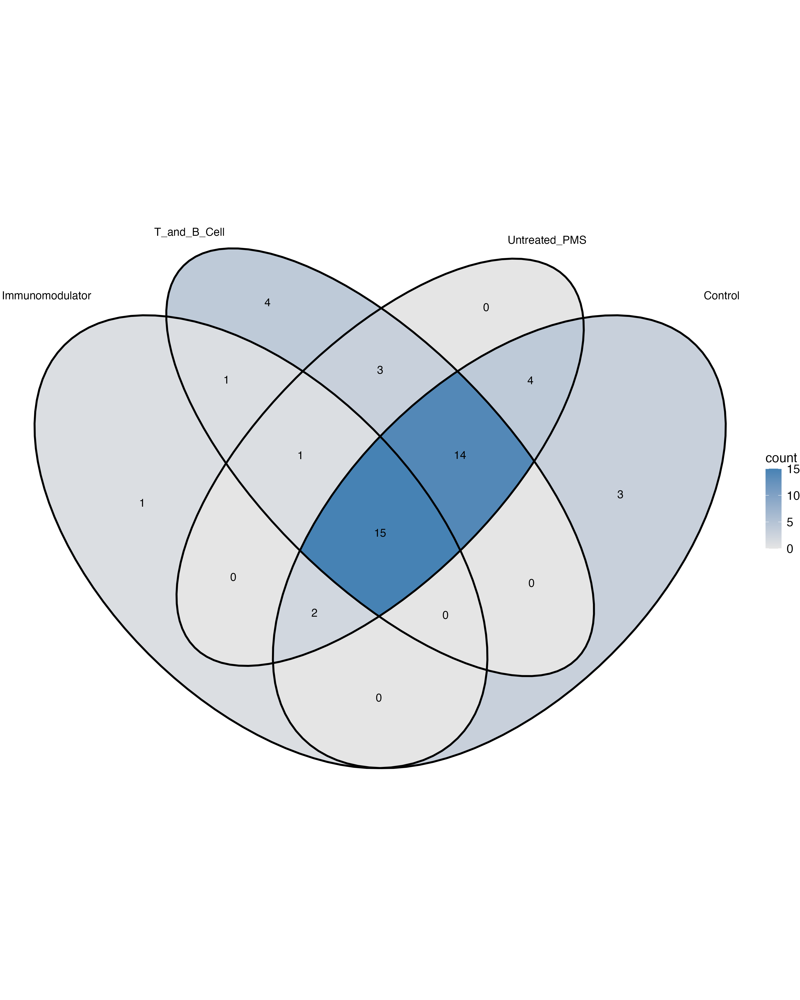
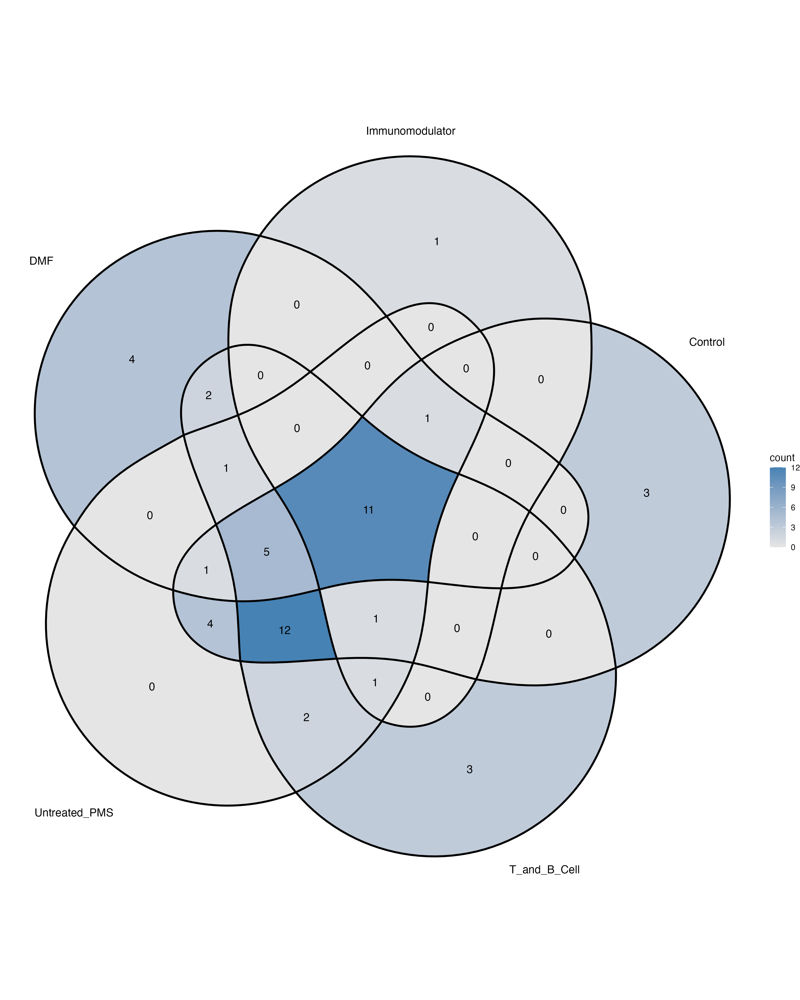

# Chapter 6 - Aim 3

## Purpose:
Identify indicator taxa that are strongly associated with treatment status and specific treatment modalities in PMS patients

## Code:
Core Microbiome Analysis
 * [Aim 3a Code](Aim3_code.R) - original code
 * [Aim 3a Code 2 Groups](Aim3a_code2.R) - code modified to compare grouped treatments (GA/IFN/DMF vs ocrevus/fingolimod)
 * [Aim 3a Code 3 Groups](Aime3a_code_3_groups.R) - code modified to compare grouped treatments (DMF vs GA/IFN vs ocrevus/fingolimod)

Indicator Species Analysis
 * [Aim 3b Code](Aim3b_code.R) - original code containing ungrouped treatments and grouping by treatment_status (control vs treated vs untreated)
 * [Aim 3b Code 2 Groups](Aim3b_code_group2.R) - code modified to compare grouped treatments (GA/IFN/DMF vs ocrevus/fingolimod)
 * [Aim 3b Code 3 Groups](Aime3a_code_group3.R) - code modified to compare grouped treatments (DMF vs GA/IFN vs ocrevus/fingolimod)

## Methods:
* Core Microbiome Analysis
  * compare healthy controls vs untreated PMS vs treated PMS
  * compare healthy controls vs untreated PMS vs all the different PMS treatments
  * compare healthy controls vs untreated PMS vs immunomodulators (Glatiramer acetate, Interferon (IFN), Dimethyl fumarate) vs T/B cell treatments (Ocrevus (rituxan), Fingolimod)
  *  * compare healthy controls vs untreated PMS vs immunomodulators (Glatiramer acetate, Interferon (IFN)) vs T/B cell treatments (Ocrevus (rituxan), Fingolimod) vs DMF
  * abundance threshold of 0.001
  * prevalence threshold of 0.5
* Indicator Species Analysis
  * compare healthy controls vs untreated PMS vs treated PMS
  * compare healthy controls vs untreated PMS vs all the different PMS treatments
  * compare healthy controls vs untreated PMS vs immunomodulators (Glatiramer acetate, Interferon (IFN), Dimethyl fumarate) vs T/B cell treatments (Ocrevus (rituxan), Fingolimod)
  * compare healthy controls vs untreated PMS vs immunomodulators (Glatiramer acetate, Interferon (IFN)) vs T/B cell treatments (Ocrevus (rituxan), Fingolimod) vs DMF

## Visualizations:
### Core microbiome analysis:

### Indicator species analysis:

