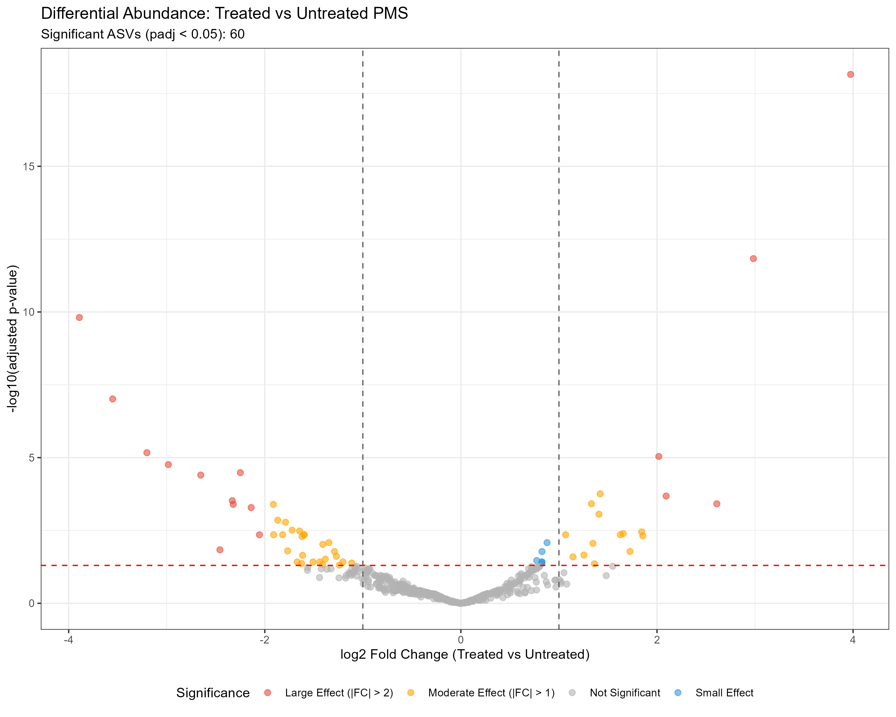
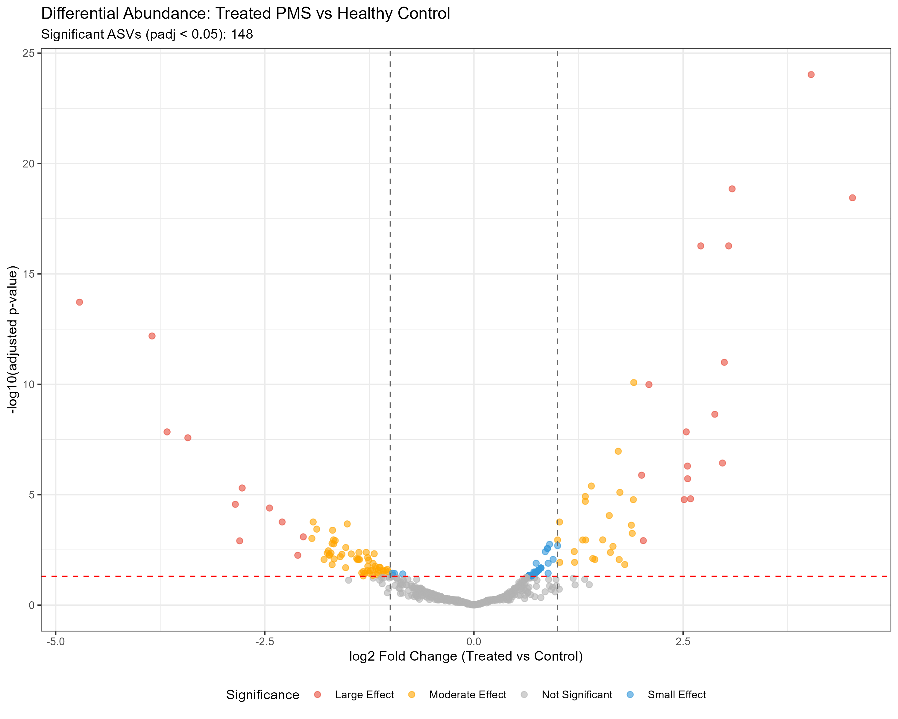
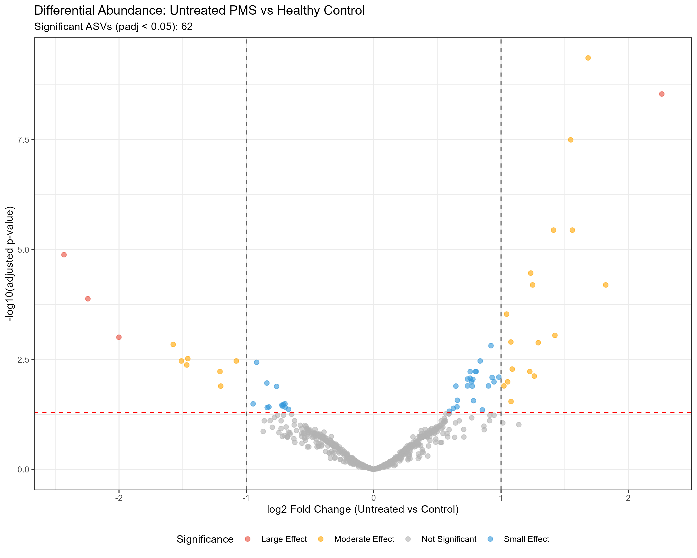

# Chapter 7 - Aim 4

## Purpose:
To identify differentially abundant bacterial taxa between treated and untreated PMS patients, and between PMS patients and healthy controls, using DESeq2 differential abundance analysis

## Code:
DESeq2: [Aim 4a Code](Chap7_deseq.R) - DESeq2 code

## Methods:
* DESeq2
  * Filtered raw phyloseq data to remove RRMS samples and RRMS-associated controls (rarefied data yielded zero significant results)
  * Used gene-wise dispersion estimation (manual approach) due to data variability
  * Performed three pairwise comparisons: Treated vs Untreated PMS, Treated vs Control, Untreated vs Control

## Visualizations:
### DESeq2 analysis (volcano plots):

