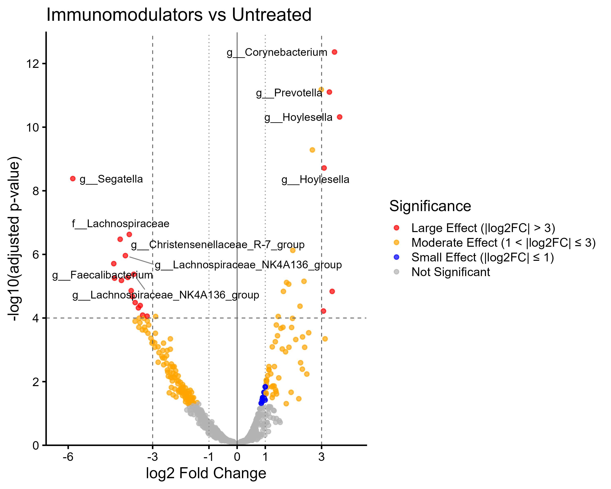
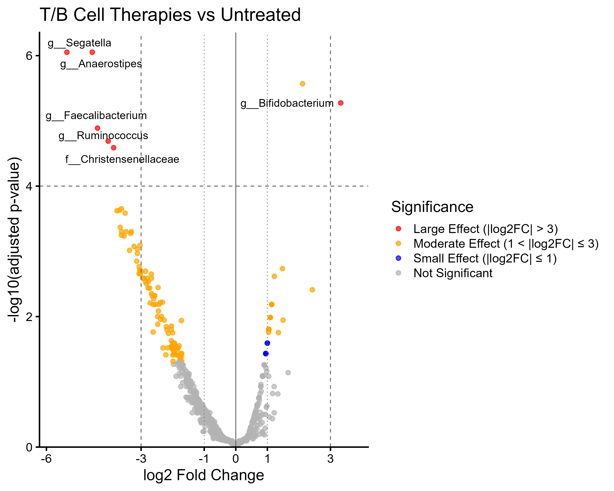
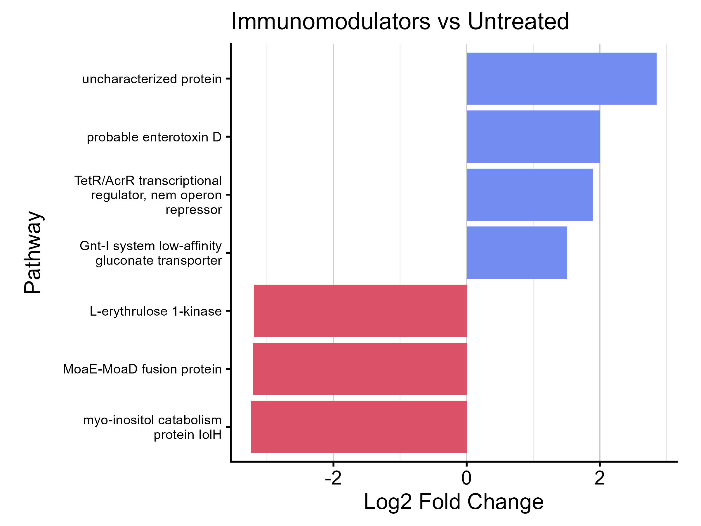

# Chapter 7 - Aim 4

## Purpose:
To identify differentially abundant bacterial taxa between treated and untreated PMS patients, and between PMS patients and healthy controls, using DESeq2 differential abundance analysis

## Code:
* [Aim 4a Code](Chap7_deseq.R) - DESeq2 code
* [Aim 4b Code](PiCRUSt2_code.R) - PiCRUST2 code

## Methods:
* DESeq2
  * Filtered raw phyloseq data to remove RRMS samples and RRMS-associated controls (rarefied data yielded zero significant results)
  * Used gene-wise dispersion estimation (manual approach) due to data variability
  * Performed three pairwise comparisons: Treated vs Untreated PMS, Treated vs Control, Untreated vs Control
  * Also performed pairwise comparisons with treatments grouped by mechanism: Immunomodulators and T/B cell therapies
 
* PiCRUST2
  * Extracted the metadata and grouped treatments into immunomodulators, T/B cell and untreated
  * Loaded KO table
  * Filtered for immunomodulators and then T and B cell
  * ran DAA using LinDA for T and B cell vs untreated and immunomodulators vs untreated
  * annotated DAA for immunomodulators and T and B cell
  * plotted results

## Visualizations:
### DESeq2 analysis (volcano plots):

### PiCRUST2 analysis:
* Immunomodulators vs Untreated had 7 significant pathways
* T and B cell vs Untreated had 0 significant pathways

